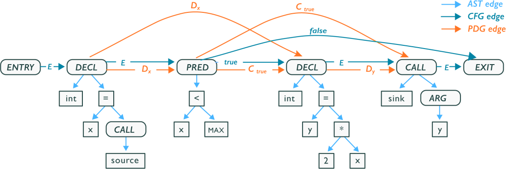

# Root Cause Analysis on Code Property Graph

## Table of Contents

- [Table of Contents](#table-of-contents)
- [Description](#description)
  - [Code Property Graph](#code-property-graph)
  - [Project Structure](#project-structure)

## Description

### Code Property Graph

A Code Property Graph (CPG) combines abstract syntax trees, control flow graphs, and data flow information into a unified graph structure. This enables powerful pattern matching, taint analysis, and semantic code understanding across multiple programming languages.

### Project structure

- services/* - Directory with Code Property Graphs
